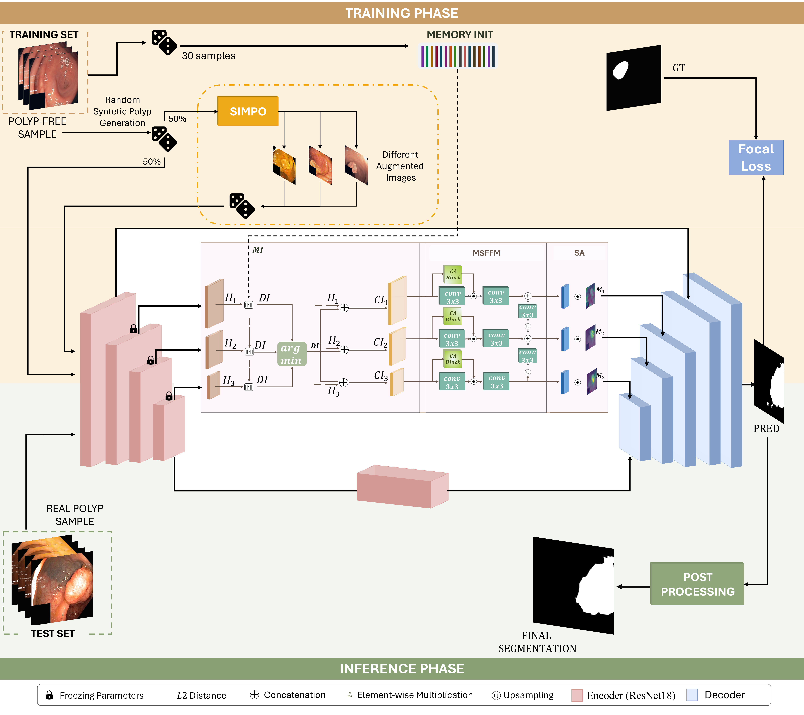
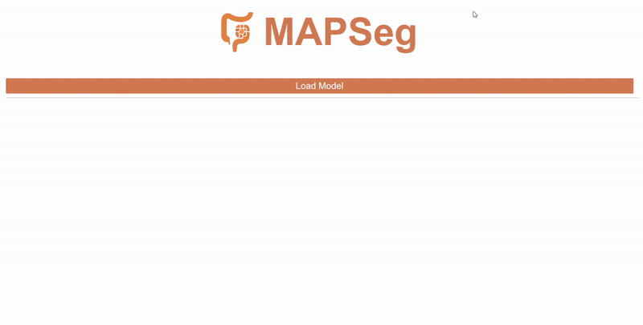

# MAPSeg

MAPSeg is a self-supervised framework for unsupervised colorectal polyp segmentation in colonoscopy images. The model operates without requiring manual annotations, leveraging a memory-augmented encoder to learn prototypical representations of healthy mucosa. Synthetic polyp-like anomalies are generated using SIMPO (SIMulation of POlyps), a domain-specific augmentation pipeline that synthesizes anatomically plausible lesions directly from normal colonoscopy images.

<p align="center">
  
</p>

This repository provides the full implementation of the MAPSeg framework, including:
- Memory-augmented segmentation architecture
- SIMPO synthetic lesion generation module
- Training and inference scripts
- Evaluation pipeline

---
#### Corresponding Paper

----
## Environments

- Recommended Python version: **3.8**
- Create a virtual environment (e.g., with `venv` or `conda`)
- Install dependencies from the provided `requirements.txt`:

```bash
pip install -r requirements.txt
```

## Data

MAPSeg utilizes a combination of public and synthetic datasets for training and evaluation.

### 🔧 Training Data
- **HyperKvasir (Normal Subset)** [[Download]](https://politecnicobari-my.sharepoint.com/:u:/g/personal/c_delprete4_phd_poliba_it/EaLJV8qzPU9BlqNde2U5diwBJbh2g7Cy-deRKyFvhI5y5w?e=GZzpIR)  
  High-resolution colonoscopy images of healthy mucosa used for self-supervised training and anomaly simulation.
- **Polyp-Like Generated Masks** [[Download]](https://drive.google.com/file/d/1PKq3N2-l86fnOGoXZ7p7FLAXQ88KvNVn/view?usp=sharing)  
  Binary masks representing abstract polyp-like shapes. These serve as shape priors for the SIMPO module during synthetic lesion generation.
- **KTH-TIPS Textures** [[Download]](https://drive.google.com/file/d/1rvm3P17f-huc1JerhWh2hVZj7YrEsodh/view?usp=sharing)  
  A collection of natural textures used to fill synthetic lesions, improving the realism and variability of simulated anomalies.

---

### 📊 Evaluation Data
#### In-Distribution (ID)
- **HyperKvasir**  
  Used to evaluate segmentation performance on data from the same distribution as the training set.

#### Out-of-Distribution (OOD)
MAPSeg is evaluated on multiple external datasets to test generalization to unseen domains:
- **CVC-ClinicDB**  [[Download]](https://www.kaggle.com/datasets/balraj98/cvcclinicdb)
- **CVC-ColonDB**   [[Download]](https://www.kaggle.com/datasets/longvil/cvc-colondb)
- **ETIS-LaribPolypDB**   [[Download]](https://www.kaggle.com/datasets/nguyenvoquocduong/etis-laribpolypdb)
- **SUN-SEG**   [[Download]](https://github.com/GewelsJI/VPS/blob/main/docs/DATA_PREPARATION.md)  

📁 Suggested directory structure
```text
MAPSeg/
│
├── dataset/
│ ├── polyp_like_mask/ # Blob masks
│ ├── KTH/ # KTH-TIPS
│ ├── HyperKvasir/
│ │ └── polyp/
│ │     └── ground_truth
│ │         └── anomaly
│ │     └── train
│ │         └── good
│ │     └── test
│ │         └── anomaly
│ │         └── good
│ ├── cvc_clinic/
│ ├── cvc_colon/
│ ├── etis/
│ └── sunseg/
```

### 3. Run

You can run the project in **training** or **inference (test)** mode by specifying the correct flags.

This will train the model using the specified dataset and configuration file:
```bash
python main.py configs=configs.yaml DATASET.target=polyp
```

This runs the model in test mode, assuming a trained model checkpoint already exists in the saved_model directory
```bash
python main.py configs=configs.yaml DATASET.target=polyp TEST.only=True
```

### 4. Demo

This demo showcases the inference capabilities of the **MAPSeg** framework for segmenting anomalies in polyp images.

<p align="center">
  
</p>

Run the demo:
```bash
voila "demo_mapseg.ipynb" --port 8866 --Voila.ip=127.0.0.1
```